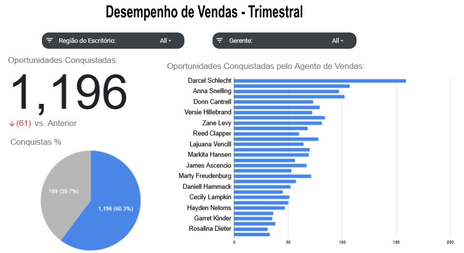

Performance de Vendas Dashboard (Sheets)

Este projeto consiste na construção de um dashboard interativo no Google Sheets para análise de desempenho trimestral de vendas.

O objetivo é permitir que gerentes de vendas acompanhem a performance da equipe de forma dinâmica e visual.

---

## Visualização do Dashboard

---

🛠 Ferramentas Utilizadas

Microsoft Excel

Tabelas Dinâmicas

Gráficos Dinâmicos

Segmentação de Dados (Slicers)

📌 Etapas do Projeto
1️⃣ Preparação dos Dados

Organização e estruturação da base de dados

Garantia de consistência para análise

2️⃣ Exploração com Tabelas Dinâmicas

Oportunidades conquistadas por trimestre

Percentual de oportunidades ganhas vs perdidas por trimestre

Oportunidades ganhas por agente de vendas

Ordenação dinâmica com trimestre mais recente primeiro

3️⃣ Construção do Dashboard

O dashboard inclui:

🔢 Scorecard com comparação entre trimestres (Q4 vs Q3 2017)

🥧 Gráfico de Pizza com percentual de oportunidades ganhas e perdidas

📊 Gráfico de Barras com ranking de agentes de vendas

Slicers para filtro por:

Região do Escritório

Manager

📈 Principais Insights

Visualização clara da evolução trimestral

Identificação dos agentes com melhor desempenho

Análise rápida de taxa de conversão (win rate)

Comparação entre regiões e gerentes

🎯 Objetivo do Projeto

Demonstrar habilidades em:

Análise exploratória de dados

Manipulação de dados no Excel

Construção de dashboards interativos

Comunicação visual de dados