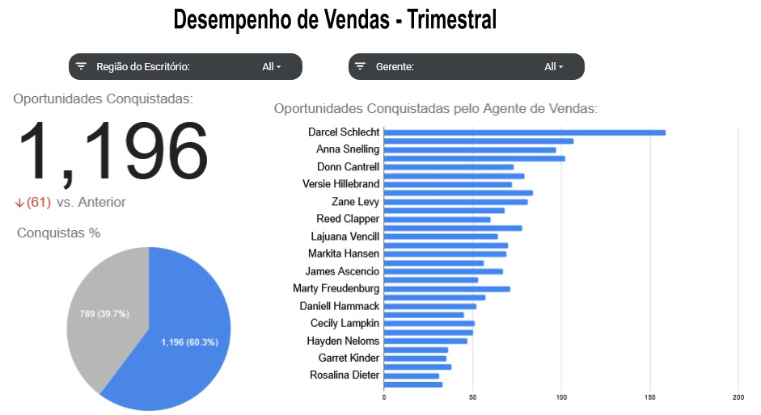

# Performance de Vendas Dashboard (Sheets)

Este projeto consiste na construção de um dashboard interativo em Excel para análise do desempenho trimestral da equipe de vendas.

O objetivo é permitir que gerentes acompanhem resultados, identifiquem padrões de performance e tomem decisões estratégicas com base em dados.

---

## Visualização do Dashboard

---
## Objetivo do Projeto:

Construir um dashboard interativo que possibilite aos gerentes de vendas monitorar:

- Oportunidades conquistadas por trimestre  
- Percentual de oportunidades ganhas vs perdidas  
- Desempenho individual dos agentes de vendas  
- Comparação entre trimestres  
- Análise por região e gerente  

---

## Ferramentas Utilizadas:

- Google Sheets 
- Tabelas Dinâmicas  
- Gráficos Dinâmicos  
- Segmentação de Dados (Slicers)  
- Scorecard Visual  

---

## Etapas do Projeto:

### 1 Preparação dos Dados
- Organização da base de dados  
- Estruturação para análise  
- Garantia de consistência nas informações  

### 2 Exploração com Tabelas Dinâmicas

Foram criadas as seguintes análises:

- Oportunidades conquistadas por trimestre  
- Percentual de oportunidades ganhas e perdidas por trimestre  
- Oportunidades ganhas por agente de vendas  
- Ordenação dos agentes em ordem decrescente por desempenho  
- Reestruturação das tabelas para que o trimestre mais recente apareça primeiro  

---

### 3 Construção do Dashboard

O dashboard final inclui:

-  Scorecard com comparação entre o trimestre mais recente (2017 Q4) e o anterior (2017 Q3)  
-  Gráfico de Pizza mostrando a porcentagem de oportunidades ganhas e perdidas no trimestre mais recente  
-  Gráfico de Barras com ranking de agentes de vendas  
---

## Principais Insights:

- Visualização clara da evolução trimestral de desempenho  
- Identificação dos agentes com melhor performance  
- Análise rápida da taxa de conversão (win rate)  
- Comparação entre regiões e gerentes  

## Este projeto demonstra habilidades em:

- Análise exploratória de dados  
- Manipulação e organização de dados no Sheets
- Construção de dashboards interativos   

---

## Aprendizado:

Este projeto foi desenvolvido acompanhando a aula disponível neste vídeo: https://www.youtube.com/watch?v=qfCjuANADlU.
Ao longo do projeto, aprofundei meus conhecimentos em conceitos e técnicas importantes 
Recomendo fortemente para quem deseja evoluir seus estudos em Data Analytics e Business Intelligence.

---

Gabriel França da Silva  
Estudante de Análise de Dados  
🔗 LinkedIn: https://www.linkedin.com/in/gabrielfranca123

